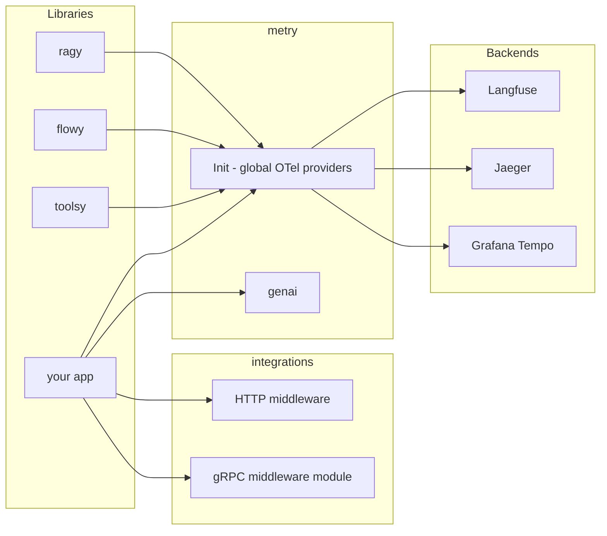

# metry

[](https://go.dev/)
[](https://opensource.org/licenses/MIT)
[](https://opentelemetry.io/)
[](https://openllmetry.io/)

**Universal, zero-boilerplate OpenTelemetry & LLMOps hub for Go AI applications. One line of code to trace them all.**

---

## Why metry

- **Zero-Boilerplate Init** — Configure Tracer, Meter, and W3C propagators in a single call. No OTel SDK setup boilerplate.
- **100% Vendor-Agnostic** — Bring your own OTel exporters and transports. `metry` configures providers and GenAI helpers without forcing OTLP gRPC or any specific backend.
- **OpenLLMetry Semantic Conventions** — Built-in typed constants and helpers for token usage, cost, and prompts (`gen_ai.system`, `gen_ai.usage`, etc.). Future-proof design allows transparent migration to official OTel GenAI semconv when they mature.
- **Plug-and-Play Middlewares** — Ready-made wrappers for `net/http`, plus optional gRPC integration published as a separate module.

## Architecture



## Installation

```bash
go get github.com/skosovsky/metry
```

Optional gRPC integration:

```bash
go get github.com/skosovsky/metry/middleware/grpc
```

## Development

For repo-local validation, use the Make targets instead of invoking `golangci-lint` directly:

```bash
make fmt
make lint
make test
make test-race
```

These targets are module-aware (`metry` + `middleware/grpc`), apply the repository's `goimports` local-prefix rules, and use cache locations that work reliably with the nested-module workspace layout.

## Quick Start

```go
package main

import (
	"context"
	"log"
	"net/http"

	"github.com/skosovsky/metry"
	metryhttp "github.com/skosovsky/metry/middleware/http"
	"go.opentelemetry.io/otel/exporters/otlp/otlpmetric/otlpmetrichttp"
	"go.opentelemetry.io/otel/exporters/otlp/otlptrace/otlptracehttp"
)

func main() {
	ctx := context.Background()

	traceExporter, err := otlptracehttp.New(ctx,
		otlptracehttp.WithEndpoint("localhost:4318"),
		otlptracehttp.WithInsecure(),
	)
	if err != nil {
		log.Fatal(err)
	}
	metricExporter, err := otlpmetrichttp.New(ctx,
		otlpmetrichttp.WithEndpoint("localhost:4318"),
		otlpmetrichttp.WithInsecure(),
	)
	if err != nil {
		log.Fatal(err)
	}

	shutdown, err := metry.Init(ctx,
		metry.WithServiceName("my-ai-service"),
		metry.WithEnvironment("production"),
		metry.WithExporter(traceExporter),
		metry.WithMetricExporter(metricExporter),
		metry.WithRecordPayloads(false), // privacy-first default; explicit here for clarity
		metry.WithTraceRatio(1.0),
	)
	if err != nil {
		log.Fatal(err)
	}
	defer shutdown(ctx)

	mux := http.NewServeMux()
	mux.HandleFunc("/", func(w http.ResponseWriter, r *http.Request) {
		w.WriteHeader(http.StatusOK)
	})
	handler := metryhttp.Handler(mux, "HTTP /")
	log.Fatal(http.ListenAndServe(":8080", handler))
}
```

`metry` no longer creates OTLP or gRPC exporters internally. Construct exporters in your application and inject them with `WithExporter` / `WithMetricExporter`.

## Semantic Conventions (LLMOps)

This version of metry does not provide `GlobalTracer()` or `GlobalMeter()`. Use `otel.Tracer("your-service/module")` and `otel.Meter("your-service/module")` for instrumentation scope so dashboards can filter traces and metrics by module.

Record token usage and cost on the current span so backends like Langfuse or Phoenix can show agent trees and costs. When you call `metry.Init` with a metric exporter, GenAI counters and streaming histograms (tokens, cost, TTFT, TPS, TBT) are registered automatically. Payload recording is opt-in; by default `metry` does not export raw prompt/completion text.

```go
import (
	"github.com/skosovsky/metry/genai"
	"go.opentelemetry.io/otel"
)

// Use a tracer named after your service/module for granular filtering in Jaeger/Grafana:
ctx, span := otel.Tracer("my-ai-service/llm").Start(ctx, "llm-call")
defer span.End()

// After the LLM responds:
genai.RecordInteraction(ctx, span,
	genai.GenAIPayload{
		System:     "You are a concise assistant.",
		Prompt:     "Summarize this",
		Completion: "Here is the summary...",
	},
	genai.GenAIUsage{
		InputTokens:  150,
		OutputTokens: 50,
		CostUSD:      0.002,
	},
)
```

Use `otel.Tracer("your-service/module")` (not a global tracer) so dashboards can filter by instrumentation scope. Spans tagged with `gen_ai.usage.*` and `gen_ai.prompt` / `gen_ai.completion` are recognized by OpenLLMetry-compatible backends when `WithRecordPayloads(true)` is enabled.

To record failures on a span in a consistent way (e.g. in HTTP/gRPC handlers or after a failed LLM call), use `traceutil.SpanError` so the span gets the error recorded and status set to Error:

```go
import "github.com/skosovsky/metry/traceutil"

// In a handler, before span.End():
if err != nil {
	traceutil.SpanError(span, err)
}
defer span.End()
```

Long prompt/completion/tool strings are truncated to 16 KB by default (UTF-8-safe, result length always ≤ limit); you can set a different limit with `metry.WithMaxGenAIContextLength(bytes)` in `Init`. Tool spans use `otel.Tracer("metry/genai")` at runtime so `genai` stays independent of the `metry` package. The library follows a **clean-break** policy: initialization is via `metry.Init` only (no `genai.Init` or legacy options). Before calling `metry.Init` again, call the returned `shutdown` so metrics can be re-registered; the test suite validates the lifecycle `Init -> shutdown -> Init`.

## Agentic & RAG Tracing

Each tool call gets its own **child span** so parallel tool invocations have correct timing in Jaeger/Tempo. Start a tool span before execution and record the result on that span; use **events** for agent steps so ReAct loops (Thought -> Action -> Observation) appear as a chronological list:

```go
// Start a child span for the tool (caller MUST call span.End(), e.g. via defer):
ctx, span := genai.StartToolSpan(ctx, "search", "call-1", `{"q":"weather"}`)
defer span.End()

// After the tool returns (result or error), record on the same span:
genai.RecordToolResult(span, `{"temp":22}`, false)

// After checking semantic cache in RAG layer:
genai.RecordCacheHit(span, true, "pgvector_cache")

// When transitioning workflow steps (e.g. in flowy); each call adds an event (no overwrite).
// Event name gen_ai.agent.step follows OTel GenAI semantic conventions.
genai.RecordAgentStep(span, "cardiologist", "specialist", "step-2")
```

## Streaming & UX Metrics

Record Time To First Token (TTFT) for streaming LLM responses. Pass the model name so dashboards can show latency per LLM (e.g. gpt-4o vs claude-3-5):

```go
start := time.Now()
// ... start streaming, receive first token ...
genai.RecordTTFT(ctx, time.Since(start).Seconds(), "gpt-4o")
```

The `gen_ai.client.ttft` histogram (unit: seconds) is exported with a `gen_ai.request.model` dimension when you call `metry.Init` with a metric exporter.

After the stream finishes, record aggregate streaming performance:

```go
// ttft measured earlier, totalDuration is end-to-end stream duration.
genai.RecordStreamingCompletion(ctx, "gpt-4o", 256, ttftSeconds, totalDuration.Seconds())
```

## Context Propagation (Baggage)

Propagate key-value metadata (e.g. `session_id`, `patient_id`) across HTTP and gRPC boundaries. Keys and values must comply with W3C Baggage; invalid key/value returns a wrapped error.

```go
// At entry point (e.g. after auth):
ctx, err := metry.SetBaggageValue(ctx, "patient_id", "p-123")
if err != nil {
	// invalid key/value (e.g. spaces, special chars)
}

// Downstream (any service receiving the context):
id := metry.BaggageValue(ctx, "patient_id") // "p-123"
```

## Security Observability

Use the `security` package to record security interventions (e.g. PII masking, LLM judges, shadow mode) as span events and to tag spans with `ai.security.*` attributes for dashboards.

```go
import "github.com/skosovsky/metry/security"

// Record an intervention as an event on the current span (e.g. from middleware):
security.RecordSecurityEvent(ctx, security.ActionBlock, "pii_masking", "PII detected in prompt", false)

// Tag the whole security pipeline span (e.g. for Grafana):
span.SetAttributes(
	security.ShadowModeKey.Bool(true),
	security.ValidatorKey.String("llm_judge"),
	security.ActionKey.String(security.ActionPass),
)
```

| Attribute | Description |
|-----------|-------------|
| `ai.security.tier` | Protection tier (e.g. 1, 2, 3). |
| `ai.security.validator` | Name of the filter (e.g. `pii_masking`, `llm_judge`, `vector_firewall`). |
| `ai.security.action` | Decision: `pass`, `block`, `redact`. Use `security.ActionPass`, `security.ActionBlock`, `security.ActionRedact`. |
| `ai.security.shadow_mode` | If `true`, blocking was virtual (shadow mode). |
| `ai.security.score` | Confidence or cosine distance for semantic checks. |
| `ai.security.reason` | Human-readable reason for block or mutation. |

To separate guard-evaluation cost from user-facing generation in billing and dashboards, pass an explicit `Purpose` inside `genai.GenAIUsage`:

```go
// Normal reply to the user (Purpose defaults to "generation" when empty):
genai.RecordInteraction(ctx, span, genai.GenAIPayload{}, genai.GenAIUsage{
	InputTokens:  150,
	OutputTokens: 50,
	CostUSD:      0.002,
})

// LLM-judge / guard evaluation — same metrics, split by purpose:
genai.RecordInteraction(ctx, span, genai.GenAIPayload{}, genai.GenAIUsage{
	InputTokens:  20,
	OutputTokens: 5,
	CostUSD:      0.0003,
	Purpose:      genai.PurposeGuardEvaluation,
})
```

## HTTP and gRPC

- **HTTP** — Wrap your handler: `metryhttp.Handler(mux, "operation-name")`.
- **gRPC** — Install `github.com/skosovsky/metry/middleware/grpc` separately, then use `metrygrpc.ServerOptions()` and `metrygrpc.ClientDialOption()`.

## Ecosystem

metry is the central observability layer for the AI stack. It makes libraries such as ragy (RAG), flowy (orchestration), and toolsy (tools) visible in production by configuring global OTel providers and standard GenAI attributes. Use `otel.Tracer("your-module")` and `otel.Meter("your-module")` for granular instrumentation scope.

## Contributing

Contributions are welcome. Please open an issue or PR.

## License

MIT. See [LICENSE](LICENSE) for details.
