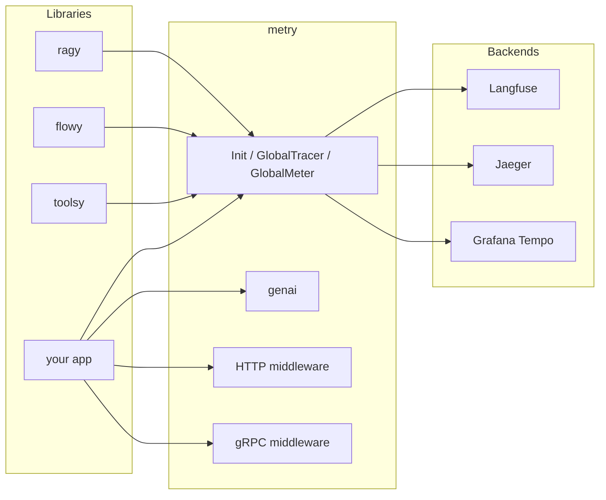

# metry

[](https://go.dev/)
[](https://opensource.org/licenses/MIT)
[](https://opentelemetry.io/)
[](https://openllmetry.io/)

**Universal, zero-boilerplate OpenTelemetry & LLMOps hub for Go AI applications. One line of code to trace them all.**

---

## Why metry

- **Zero-Boilerplate Init** — Configure Tracer, Meter, and W3C propagators in a single call. No OTel SDK setup boilerplate.
- **100% Vendor-Agnostic (OTLP First)** — Works out of the box with Jaeger, Grafana Tempo, Langfuse, Phoenix, Datadog. Swap the backend by changing one line.
- **OpenLLMetry Semantic Conventions** — Built-in typed constants and helpers for token usage, cost, and prompts (`gen_ai.system`, `gen_ai.usage`, etc.).
- **Plug-and-Play Middlewares** — Ready-made wrappers for `net/http` and gRPC to create root spans and propagate `trace_id`.

## Architecture



## Installation

```bash
go get github.com/skosovsky/metry
```

## Quick Start

```go
package main

import (
	"context"
	"log"
	"net/http"

	"github.com/skosovsky/metry"
	metryhttp "github.com/skosovsky/metry/middleware/http"
)

func main() {
	ctx := context.Background()

	te, me := metry.OTLPGRPC("localhost:4317", true)
	shutdown, err := metry.Init(ctx, metry.Options{
		ServiceName:    "my-ai-service",
		Environment:    "production",
		TraceExporter:  te,
		MetricExporter: me,
		TraceRatio:     metry.Float64(1.0),
	})
	if err != nil {
		log.Fatal(err)
	}
	defer shutdown(ctx)

	mux := http.NewServeMux()
	mux.HandleFunc("/", func(w http.ResponseWriter, r *http.Request) {
		w.WriteHeader(http.StatusOK)
	})
	handler := metryhttp.Handler(mux, "HTTP /")
	log.Fatal(http.ListenAndServe(":8080", handler))
}
```

## Semantic Conventions (LLMOps)

Record token usage and cost on the current span so backends like Langfuse or Phoenix can show agent trees and costs. To also emit OTel counters for token usage and cost (e.g. for Grafana), call `genai.Init` once after `metry.Init`:

```go
import (
	"log"

	"github.com/skosovsky/metry"
	"github.com/skosovsky/metry/genai"
)

// After metry.Init, enable GenAI metric counters (optional; RecordUsage still sets span attributes without this):
if err := genai.Init(metry.GlobalMeter()); err != nil {
	log.Fatal(err)
}

// Inside your LLM call handler:
ctx, span := metry.GlobalTracer().Start(ctx, "llm-call")
defer span.End()

// After the LLM responds:
genai.RecordUsage(ctx, span, 150, 50, 0.002)  // input tokens, output tokens, cost USD
genai.RecordInteraction(span, "Summarize this", "Here is the summary...")
```

Spans tagged with `gen_ai.usage.*` and `gen_ai.prompt` / `gen_ai.completion` are recognized by OpenLLMetry-compatible backends for dashboards and agent traces.

## Agentic & RAG Tracing

Tag tool calls and cache hits on spans so backends can show tool usage and RAG behavior:

```go
// Before executing a tool (e.g. inside toolsy):
genai.RecordToolCall(span, "search", "call-1", `{"q":"weather"}`)

// After checking semantic cache in RAG layer:
genai.RecordCacheHit(span, true, "pgvector_cache")

// When transitioning workflow steps (e.g. in flowy):
genai.RecordAgentState(span, "cardiologist", "specialist", "step-2")
```

## Streaming & UX Metrics

Record Time To First Token (TTFT) for streaming LLM responses. Requires `genai.Init(metry.GlobalMeter())` to be called first:

```go
start := time.Now()
// ... start streaming, receive first token ...
genai.RecordTTFT(ctx, time.Since(start).Seconds())
```

The `gen_ai.client.ttft` histogram (unit: seconds) is exported with the rest of your OTel metrics for dashboards and SLOs.

## Context Propagation (Baggage)

Propagate key-value metadata (e.g. `session_id`, `patient_id`) across HTTP and gRPC boundaries. Keys must be valid W3C baggage identifiers (no spaces or special characters like `/`).

```go
// At entry point (e.g. after auth):
ctx, err := metry.ContextWithBaggage(ctx, "patient_id", "p-123")
if err != nil {
	// invalid key
}

// Downstream (any service receiving the context):
id := metry.BaggageValue(ctx, "patient_id") // "p-123"
```

## HTTP and gRPC

- **HTTP** — Wrap your handler: `metryhttp.Handler(mux, "operation-name")`.
- **gRPC** — Use `metrygrpc.ServerOptions()` when creating the server and `metrygrpc.ClientDialOption()` when creating the client.

## Ecosystem

metry is the central observability layer for the AI stack. It makes libraries such as ragy (RAG), flowy (orchestration), and toolsy (tools) visible in production by providing a single tracer and meter and standard GenAI attributes.

## Contributing

Contributions are welcome. Please open an issue or PR.

## License

MIT. See [LICENSE](LICENSE) for details.
