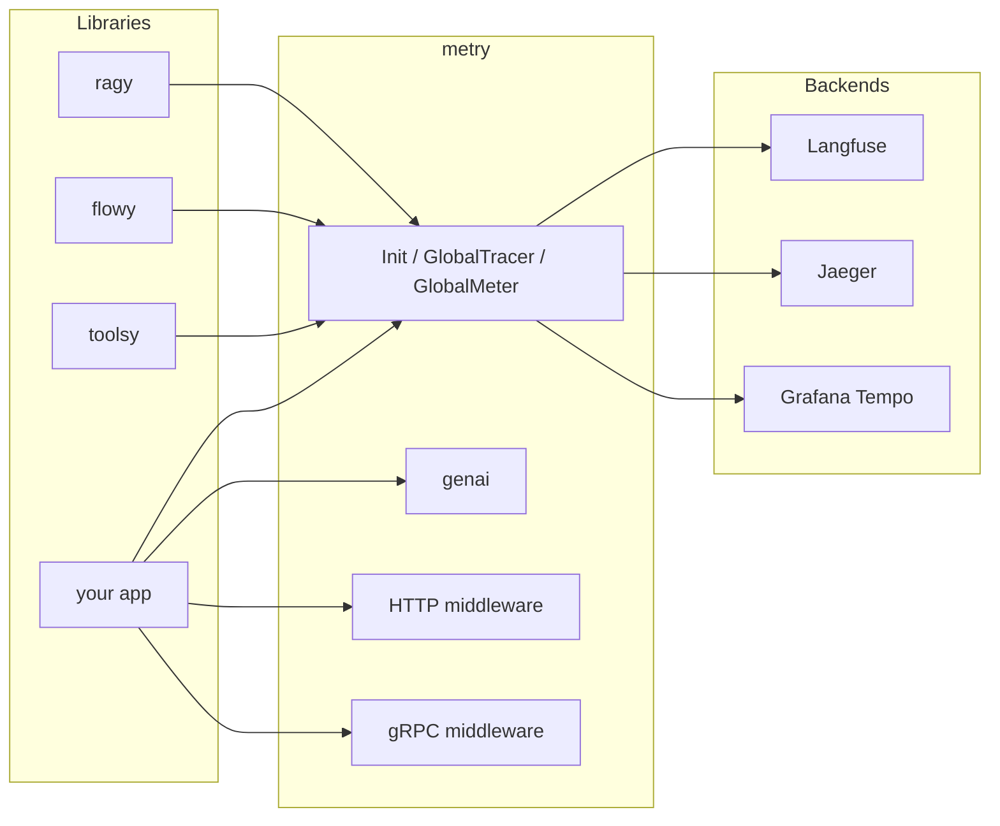

# metry

[](https://go.dev/)
[](https://opensource.org/licenses/MIT)
[](https://opentelemetry.io/)
[](https://openllmetry.io/)

**Universal, zero-boilerplate OpenTelemetry & LLMOps hub for Go AI applications. One line of code to trace them all.**

---

## Why metry

- **Zero-Boilerplate Init** — Configure Tracer, Meter, and W3C propagators in a single call. No OTel SDK setup boilerplate.
- **100% Vendor-Agnostic (OTLP First)** — Works out of the box with Jaeger, Grafana Tempo, Langfuse, Phoenix, Datadog. Swap the backend by changing one line.
- **OpenLLMetry Semantic Conventions** — Built-in typed constants and helpers for token usage, cost, and prompts (`gen_ai.system`, `gen_ai.usage`, etc.). Future-proof design allows transparent migration to official OTel GenAI semconv when they mature.
- **Plug-and-Play Middlewares** — Ready-made wrappers for `net/http` and gRPC to create root spans and propagate `trace_id`.

## Architecture



## Installation

```bash
go get github.com/skosovsky/metry
```

## Quick Start

```go
package main

import (
	"context"
	"log"
	"net/http"

	"github.com/skosovsky/metry"
	metryhttp "github.com/skosovsky/metry/middleware/http"
)

func main() {
	ctx := context.Background()

	shutdown, err := metry.Init(ctx,
		metry.WithServiceName("my-ai-service"),
		metry.WithEnvironment("production"),
		metry.WithOTLPGRPC("localhost:4317", true),
		metry.WithTraceRatio(1.0),
	)
	if err != nil {
		log.Fatal(err)
	}
	defer shutdown(ctx)

	mux := http.NewServeMux()
	mux.HandleFunc("/", func(w http.ResponseWriter, r *http.Request) {
		w.WriteHeader(http.StatusOK)
	})
	handler := metryhttp.Handler(mux, "HTTP /")
	log.Fatal(http.ListenAndServe(":8080", handler))
}
```

## Semantic Conventions (LLMOps)

Record token usage and cost on the current span so backends like Langfuse or Phoenix can show agent trees and costs. When you call `metry.Init` with a metric exporter, GenAI counters (tokens, cost, TTFT) are registered automatically.

```go
import (
	"github.com/skosovsky/metry"
	"github.com/skosovsky/metry/genai"
)

// Inside your LLM call handler:
ctx, span := metry.GlobalTracer().Start(ctx, "llm-call")
defer span.End()

// After the LLM responds:
genai.RecordUsage(ctx, span, 150, 50, 0.002)  // input tokens, output tokens, cost USD
genai.RecordInteraction(span, "Summarize this", "Here is the summary...")
```

Spans tagged with `gen_ai.usage.*` and `gen_ai.prompt` / `gen_ai.completion` are recognized by OpenLLMetry-compatible backends. Long prompt/completion strings are truncated to 16 KB to protect OTLP export pipelines. The library follows a **clean-break** policy: initialization is via `metry.Init` only (no `genai.Init` or legacy options). The test suite validates the lifecycle `Init -> shutdown -> Init` by asserting that TTFT and usage datapoints are actually exported after the second Init.

## Agentic & RAG Tracing

Tag tool calls and cache hits on spans so backends can show tool usage and RAG behavior. Use **events** for agent steps so ReAct loops (Thought -> Action -> Observation) appear as a chronological list in Jaeger/Tempo:

```go
// Before executing a tool (e.g. inside toolsy):
genai.RecordToolCall(span, "search", "call-1", `{"q":"weather"}`)

// After the tool returns (e.g. result or error):
genai.RecordToolResult(span, "search", `{"temp":22}`, false)

// After checking semantic cache in RAG layer:
genai.RecordCacheHit(span, true, "pgvector_cache")

// When transitioning workflow steps (e.g. in flowy); each call adds an event (no overwrite):
genai.RecordAgentStep(span, "cardiologist", "specialist", "step-2")
```

## Streaming & UX Metrics

Record Time To First Token (TTFT) for streaming LLM responses. Pass the model name so dashboards can show latency per LLM (e.g. gpt-4o vs claude-3-5):

```go
start := time.Now()
// ... start streaming, receive first token ...
genai.RecordTTFT(ctx, time.Since(start).Seconds(), "gpt-4o")
```

The `gen_ai.client.ttft` histogram (unit: seconds) is exported with a `gen_ai.request.model` dimension when you call `metry.Init` with a metric exporter.

## Context Propagation (Baggage)

Propagate key-value metadata (e.g. `session_id`, `patient_id`) across HTTP and gRPC boundaries. Keys must be valid W3C baggage identifiers (no spaces or special characters like `/`).

```go
// At entry point (e.g. after auth):
ctx, err := metry.ContextWithBaggage(ctx, "patient_id", "p-123")
if err != nil {
	// invalid key
}

// Downstream (any service receiving the context):
id := metry.BaggageValue(ctx, "patient_id") // "p-123"
```

## Security Observability

Use the `security` package to record security interventions (e.g. PII masking, LLM judges, shadow mode) as span events and to tag spans with `ai.security.*` attributes for dashboards.

```go
import "github.com/skosovsky/metry/security"

// Record an intervention as an event on the current span (e.g. from middleware):
security.RecordSecurityEvent(ctx, security.ActionBlock, "pii_masking", "PII detected in prompt", false)

// Tag the whole security pipeline span (e.g. for Grafana):
span.SetAttributes(
	security.ShadowModeKey.Bool(true),
	security.ValidatorKey.String("llm_judge"),
	security.ActionKey.String(security.ActionPass),
)
```

| Attribute | Description |
|-----------|-------------|
| `ai.security.tier` | Protection tier (e.g. 1, 2, 3). |
| `ai.security.validator` | Name of the filter (e.g. `pii_masking`, `llm_judge`, `vector_firewall`). |
| `ai.security.action` | Decision: `pass`, `block`, `redact`. Use `security.ActionPass`, `security.ActionBlock`, `security.ActionRedact`. |
| `ai.security.shadow_mode` | If `true`, blocking was virtual (shadow mode). |
| `ai.security.score` | Confidence or cosine distance for semantic checks. |
| `ai.security.reason` | Human-readable reason for block or mutation. |

To separate guard-evaluation cost from user-facing generation in billing and dashboards, record usage with an explicit purpose so it is written to both span attributes and metric data points. Use `genai.RecordUsage` (defaults to `genai.PurposeGeneration`) for normal user-facing calls, and `genai.RecordUsageWithPurpose(..., genai.PurposeGuardEvaluation)` for LLM-judge or other guard calls:

```go
// Normal reply to the user (purpose = "generation"):
genai.RecordUsage(ctx, span, 150, 50, 0.002)

// LLM-judge / guard evaluation (purpose = "guard_evaluation") — same metrics, split by purpose:
genai.RecordUsageWithPurpose(ctx, span, 20, 5, 0.0003, genai.PurposeGuardEvaluation)
```

## HTTP and gRPC

- **HTTP** — Wrap your handler: `metryhttp.Handler(mux, "operation-name")`.
- **gRPC** — Use `metrygrpc.ServerOptions()` when creating the server and `metrygrpc.ClientDialOption()` when creating the client.

## Ecosystem

metry is the central observability layer for the AI stack. It makes libraries such as ragy (RAG), flowy (orchestration), and toolsy (tools) visible in production by providing a single tracer and meter and standard GenAI attributes.

## Contributing

Contributions are welcome. Please open an issue or PR.

## License

MIT. See [LICENSE](LICENSE) for details.
